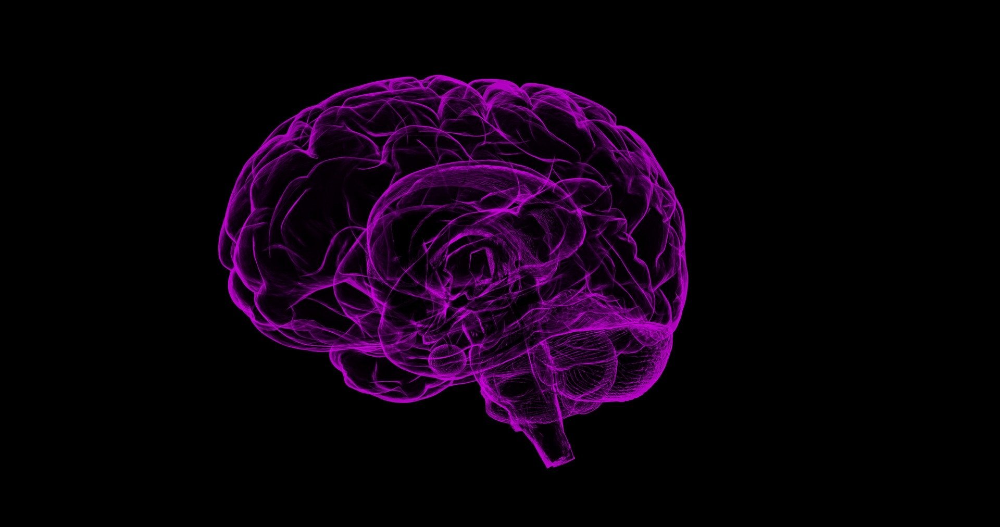

# Brainhack School 2020 Project

Team contributors: Stephanie Alley

## Summary
Functional MRI (fMRI) is an important modality for studying brain function. Machine learning models are often used to analyze fMRI data, whether it be a simple classification or regression problem or something more complex. While the focus of a study is often centered on the model architecture, data preprocessing also plays a vital role in a model's success. This project will explore the effect that various preprocessing options may have on the prediction performance of a machine learning model for age prediction using resting state fMRI.

## Project definition

### Background
I am a third year PhD student at Polytechnique with a background in MRI. My primary goal for this project is to become more proficient with tools that further open, reproducible science. Even the most valiant attempts at sharing data and code can fall short in terms of reproducibility, so I aim to incorporate multiple tools and strategies to promote the reliable reproducibility of this project.

One important source of variability across studies is a lack of standardization in preprocessing steps. This project will focus on the effect that preprocessing choices may have on the prediction performance of a machine learning model. Specifically, two processing steps that affect the extraction of functional signal will be examined: atlas choice and confound removal.

The impact of these choices will be assessed by evaluating the prediction performance of a machine learning model. This model will be based on the Support Vector Regressor model used in Week 1 for age prediction. A separate model will be trained for each preprocessing option. The prediction performance will then be evaluated by calculating the accuracy and mean absolute error of each model.

### Tools
* Python for processing, analysis, and visualization
* Docker for creating an isolated environment for the processing and analysis that can be shared to improve reproducibility
* Git/GitHub for version control of the project, including the markdown document and the code
* Nilearn for implementation of the machine learning model
* DataLad for version control of the data through processing and analysis
* Jupyter notebooks for accessibility and sharing of the code, analysis, and visualizations
* Visualization (plotly) for creating interactive figures
* Binder for incorporating the GitHub repository, Docker file, and Jupyter notebooks into a live environment that can be easily shared

### Data
rs-fMRI brain development dataset based on viewing of short animated film (obtained from OpenNeuro as ds000228)1
* 155 subjects
  * 122 children
  * 33 adults

### Deliverables
* GitHub repository containing all items related to the project, including the markdown document, Docker file, requirements.txt, and Jupyter notebooks
* Complete markdown document (README.md) containing all of the relevant project information
* Docker file to specify the Docker image
* requirements.txt to specify the Python environment
* Jupyter notebook containing the code for the processing and analysis, as well as the visualizations
* Interactive notebook using Binder for reproducible sharing of the entire project
* Presentation slides for final project presentation

## References
1. Richardson, H., Lisandrelli, G., Riobueno-Naylor, A., & Saxe, R. (2018). Development of the social brain from age three to twelve years. Nature Communications, 9(1). https://doi.org/10.1038/s41467-018-03399-2
